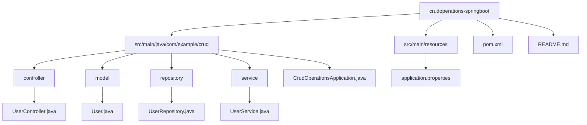

# CRUD Operations with Spring Boot


## 📌 Introduction
This project demonstrates a **CRUD (Create, Read, Update, Delete) API** built using **Spring Boot** with **Spring Data JPA** and **MySQL**. The application manages a simple database of entities and exposes RESTful APIs for interacting with the system.

## 🔥 Features
✔️ Spring Boot framework with RESTful API  
✔️ Spring Data JPA for database interaction  
✔️ MySQL database integration  
✔️ Swagger API documentation  
✔️ Exception handling and validation  
✔️ Docker support (if added)  

---

## 🛠 Tech Stack
- **Spring Boot** - Backend framework  
- **Spring Data JPA** - ORM for database  
- **MySQL** - Relational database  


---

### 📂 Project Structure


---

## 🚀 API Endpoints

| Method | Endpoint         | Description             |
|--------|-----------------|-------------------------|
| GET    | /users          | Fetch all users        |
| GET    | /users/{id}     | Fetch user by ID       |
| POST   | /users          | Create a new user      |
| PUT    | /users/{id}     | Update user details    |
| DELETE | /users/{id}     | Delete a user          |

---

## 🔧 Setup and Installation

### 📌 Prerequisites:
1. Install **Java 17+**
2. Install **MySQL**
3. Install **Maven**

### 🚀 Steps to Run:
```sh
# Clone the repository
git clone https://github.com/RajivRatan27/crudoperations-springboot.git

# Navigate to project directory
cd crudoperations-springboot

# Configure MySQL database in src/main/resources/application.properties
# Example:
# spring.datasource.url=jdbc:mysql://localhost:3306/crud_db
# spring.datasource.username=root
# spring.datasource.password=root

# Build the project
mvn clean install

# Run the application
mvn spring-boot:run

